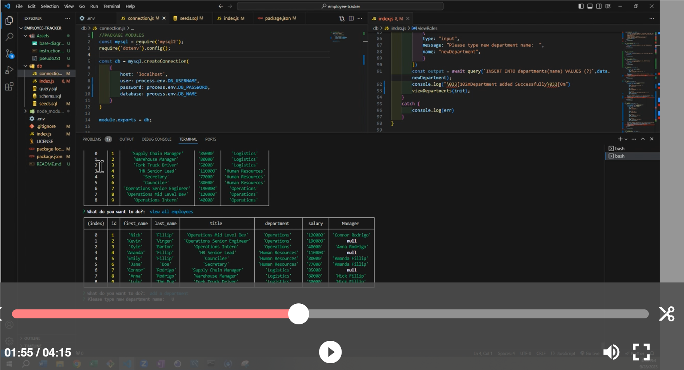

# employee-tracker 

---
## Description
    
Command prompts in CIL that manipulate and display data from 3 various tables (departments, roles, employees) based off of user input

---    
## Table of Contents

+ **[Installation](#installation)**
+ **[Usage](#usage)**
+ **[License](#license)**
+ **[Contributing](#contributing)**
+ **[Tests](#tests)**

---  
## Installation
    
N/A

---    
## Usage
    
The reason behind the file is to display my ability to use the inquirer package, mySQL2, promisify objects, and modularization to build a dataset, manipulate the dataset, and display the data based off a user's input. (node.JS, javascript, mySQL)

---    
## License
    
MIT

---
## Contributing
    
UDenver Bootcamp

---
## Tests
npm i
nodemon index.js

---
## Questions

**Contact Me:**
Email: [nick.m.fillip@gmail.com](nick.m.fillip@gmail.com)
Cell: (281) 216 - 2183
Github Profile: [https://github.com/nfillip](https://github.com/nfillip)

---

    

## Website
Github Repo: [https://github.com/nfillip/employee-tracker](https://github.com/nfillip/employee-tracker) 
Video Walk-Through: [https://drive.google.com/file/d/1P7rrHbwXpf9fG0Qw7C-BQoQGRkIB5RtR/view](https://drive.google.com/file/d/1P7rrHbwXpf9fG0Qw7C-BQoQGRkIB5RtR/view)

---
© 2023 nfillip LLC. All Rights Reserved.